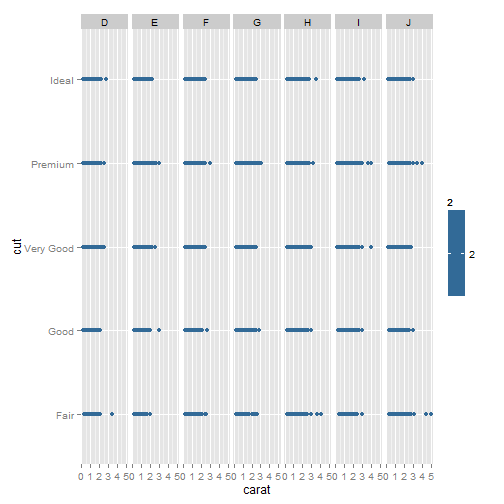

## Slide 1


> This slidify presentation serves as a reproducible pitch for the Course Project of Developing Data Products course offered by Johns Hopkins University on Coursera.  


> The objective of the project is to build a Shiny app and deploy it online.

---

## Slide 2

> The app that has been developed is a visualization tool which generates dot-plots between various variables of the `Diamonds` dataset, part of the `ggplot2` package.  

> The dot-plots are also generated using the `ggplot2` package. 

> The Shiny app has a slider input feature to select the number of observations ranging from 1000 to 53940.  

> Features like color and facets can also be used to segregate the resulting plots on the basis of the various aspects of the diamonds dataset.

---

## Slide 3

Summary of the `Diamonds` dataset.


```
##      carat               cut        color        clarity          depth           table      
##  Min.   :0.2000   Fair     : 1610   D: 6775   SI1    :13065   Min.   :43.00   Min.   :43.00  
##  1st Qu.:0.4000   Good     : 4906   E: 9797   VS2    :12258   1st Qu.:61.00   1st Qu.:56.00  
##  Median :0.7000   Very Good:12082   F: 9542   SI2    : 9194   Median :61.80   Median :57.00  
##  Mean   :0.7979   Premium  :13791   G:11292   VS1    : 8171   Mean   :61.75   Mean   :57.46  
##  3rd Qu.:1.0400   Ideal    :21551   H: 8304   VVS2   : 5066   3rd Qu.:62.50   3rd Qu.:59.00  
##  Max.   :5.0100                     I: 5422   VVS1   : 3655   Max.   :79.00   Max.   :95.00  
##                                     J: 2808   (Other): 2531                                  
##      price             x                y                z         
##  Min.   :  326   Min.   : 0.000   Min.   : 0.000   Min.   : 0.000  
##  1st Qu.:  950   1st Qu.: 4.710   1st Qu.: 4.720   1st Qu.: 2.910  
##  Median : 2401   Median : 5.700   Median : 5.710   Median : 3.530  
##  Mean   : 3933   Mean   : 5.731   Mean   : 5.735   Mean   : 3.539  
##  3rd Qu.: 5324   3rd Qu.: 6.540   3rd Qu.: 6.540   3rd Qu.: 4.040  
##  Max.   :18823   Max.   :10.740   Max.   :58.900   Max.   :31.800  
## 
```


---

## Slide 4

An example of the plot generated by the app.

 

